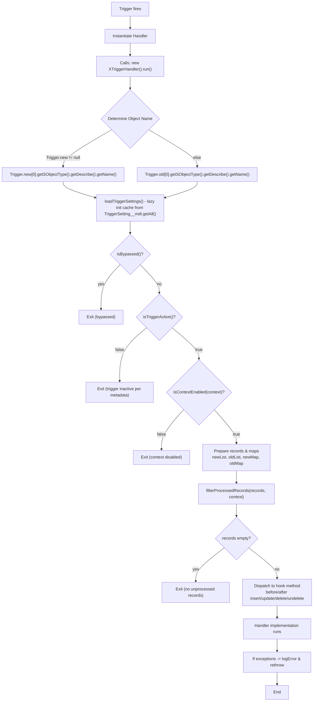

# Trigger Settings with Custom Metadata Type

## Overview
This framework provides an object-based way to control trigger execution using a Custom Metadata Type. Triggers and their handler classes can be enabled/disabled at runtime via metadata, and the TriggerHandler base class implements caching, recursion prevention, and programmatic bypass controls used by concrete TriggerHandler subclasses.

This README documents the actual implementation in force-app/main/default/classes/TriggerHandler.cls (as of the current repo), including a few implementation notes where behavior diverges from common expectations.

## Quick summary of actual behavior (implementation-accurate)
- Trigger object detection: uses Trigger.new/Trigger.old to determine the SObject type and calls getDescribe().getName() to derive the object name.
- Settings loading: uses TriggerSetting__mdt.getAll().values() and caches the records in a static Map keyed by TriggerSetting__mdt.ObjectName__c. Loading happens once per transaction (lazy-initialized).
- Fail-safe behavior (implementation): TriggerHandler.isTriggerActive() returns `setting != null || setting.IsActive__c`. This is the exact code behaviour and should be noted as a potential logical issue (see Implementation Note below). This README documents the implemented behavior (do not assume different semantics).
- Context → Metadata field mapping: mapping between System.TriggerOperation and metadata checkbox field names is defined in CONTEXT_FIELD_MAP:
  - BEFORE_INSERT => RunBeforeInsert__c
  - BEFORE_UPDATE => RunBeforeUpdate__c
  - BEFORE_DELETE => RunBeforeDelete__c
  - AFTER_INSERT => RunAfterInsert__c
  - AFTER_UPDATE => RunAfterUpdate__c
  - AFTER_DELETE => RunAfterDelete__c
  - AFTER_UNDELETE => RunAfterUndelete__c
- Context enablement: isContextEnabled(context) looks up the mapped field on the TriggerSetting__mdt instance and returns (Boolean) value if present and a Boolean, otherwise falls back to true.
- Recursion control: processedByContext is a Map<String, Set<Id>> keyed by "ObjectName_TriggerOperation" and tracks record Ids processed in each context to avoid re-processing the same record in the same context within a transaction.
  - BEFORE_INSERT is treated specially: because records do not have Ids yet, filterProcessedRecords returns the original list unfiltered for BEFORE_INSERT.
- Programmatic bypass: bypassedObjects is a static Set<String> you can add an object name to with TriggerHandler.bypass(objectName). Methods provided:
  - public static void bypass(String objectName)
  - public static void clearBypass(String objectName)
  - public static void clearAllBypasses()
  - public Boolean isBypassed() (instance method) checks bypassedObjects for the current object
- Logging helpers:
  - logOnce(String message) — logs a WARN message only once per unique key using a static loggedKeys set.
  - logError(String message, Exception e) — logs error message and exception stack trace.
- Error handling: run() wraps execution in a try/catch, logs the error and stack trace, then re-throws the exception.
- Hook surface: TriggerHandler exposes protected virtual hook methods (empty implementations) for subclasses to override:
  - beforeInsert(List<SObject> records)
  - afterInsert(List<SObject> records, Map<Id,SObject> newMap)
  - beforeUpdate(List<SObject> newRecords, List<SObject> oldRecords, Map<Id,SObject> newMap, Map<Id,SObject> oldMap)
  - afterUpdate(List<SObject> newRecords, List<SObject> oldRecords, Map<Id,SObject> newMap, Map<Id,SObject> oldMap)
  - beforeDelete(List<SObject> oldRecords, Map<Id,SObject> oldMap)
  - afterDelete(List<SObject> oldRecords, Map<Id,SObject> oldMap)
  - afterUndelete(List<SObject> newRecords, Map<Id,SObject> newMap)

## Mermaid diagram (rendered by "Markdown Preview Mermaid Support" extension)
If you have the "Markdown Preview Mermaid Support" extension (bierner.markdown-mermaid) installed, VS Code's Markdown preview will render the following Mermaid chart. Open this README and press Ctrl+Shift+V (Windows) or use "Markdown: Open Preview" from the Command Palette. If the extension is active the diagram will render inline.



(If the Mermaid doesn't render: open the .mmd file and try the Mermaid extension's preview command — steps provided below.)

## Custom Metadata Type: TriggerSetting__mdt
Location: force-app/main/default/objects/TriggerSetting__mdt/

Fields used by the code:
- ObjectName__c (Text) — used as the key; TriggerSetting__mdt.getAll() values are keyed by this value when building the cache.
- IsActive__c (Checkbox)
- RunBeforeInsert__c, RunBeforeUpdate__c, RunBeforeDelete__c, RunAfterInsert__c, RunAfterUpdate__c, RunAfterDelete__c, RunAfterUndelete__c (Checkboxes) — optional per-context toggles

Important: the code uses TriggerSetting__mdt.getAll().values() and then uses setting.ObjectName__c as the cache key. Ensure ObjectName__c matches the value returned by Trigger.sObjectType.getDescribe().getName() (for example `Account`, `Contact`, `MyCustomObject__c`).

## How to use the framework

1. One-line trigger:
```apex
trigger AccountTrigger on Account (before insert, after insert, before update, after update, before delete, after delete, after undelete) {
    new AccountTriggerHandler().run();
}
```

2. Handler class:
- Subclass TriggerHandler (e.g., AccountTriggerHandler extends TriggerHandler)
- Override the protected virtual hook methods you need and cast SObject lists/maps to typed SObject collections inside your handler.

Example:
```apex
public class AccountTriggerHandler extends TriggerHandler {
    public AccountTriggerHandler() {
        super();
    }

    protected override void beforeInsert(List<SObject> records) {
        List<Account> accounts = (List<Account>) records;
        // bulk-safe logic here
    }

    protected override void afterUpdate(List<SObject> newRecords, List<SObject> oldRecords,
                                        Map<Id,SObject> newMap, Map<Id,SObject> oldMap) {
        List<Account> newAccounts = (List<Account>) newRecords;
        Map<Id,Account> oldAccountMap = (Map<Id,Account>) oldMap;
        // compare newAccounts with oldAccountMap and act
    }
}
```

3. Create Custom Metadata record:
- Setup > Custom Metadata Types > Trigger Setting > Manage Records
- New record:
  - Label: Account (or any label)
  - ObjectName__c: Account (must match describe name)
  - IsActive__c: true (to enable; see Implementation Note)
  - Optionally set per-context Run*__c fields to enable/disable specific contexts

4. Programmatic bypass (useful in tests or special flows):
```apex
TriggerHandler.bypass('Account');          // add to bypass set
TriggerHandler.clearBypass('Account');     // remove single bypass
TriggerHandler.clearAllBypasses();         // clear all bypasses
```
Note: bypass is static state and applies for the remainder of the transaction. Tests should manage static state carefully.

## Implementation Notes & Observations (Important)
- isTriggerActive() logic: current implementation returns `setting != null || setting.IsActive__c`. This means:
  - If a metadata record exists (setting != null) the method returns true regardless of the value of IsActive__c.
  - If no metadata record exists, it will attempt to read IsActive__c on a null setting which may throw a NullPointerException in some code paths; however the actual code uses the expression as-is — please review or adjust if the intended behavior is "enabled only when setting exists AND IsActive__c == true".
- The README used to claim "defaults to INACTIVE if no metadata record exists". The current code's returned value contradicts that claim. This README documents the current implemented behavior and flags the discrepancy so repository owners can choose to correct code or documentation.
- There is no resetAll() method in TriggerHandler.cls. References to resetAll() or similar helper methods in prior docs were removed from this README. Tests should reset static state by calling clearAllBypasses() and by ensuring static caches are isolated between tests if needed (or by invoking the test's static context isolation).
- isContextEnabled(context) will:
  - return true if the setting is null
  - else look up the mapped field name and get setting.get(fieldName)
  - if the retrieved value is a Boolean it returns that Boolean; otherwise defaults to true
- filterProcessedRecords(...) returns the input records unfiltered for BEFORE_INSERT (because records have no Ids). For other contexts it uses processedByContext keyed by "ObjectName_Context" to track processed Ids.

## Tests and Testing Guidance
- Custom Metadata cannot be inserted in regular Apex unit tests by DML. Typical options:
  - Use the bypass() API to disable triggers in test setup
  - Use @TestVisible helpers or test-specific constructors if added
  - Rely on Metadata API or stubbing frameworks if needed for full metadata-based tests
- Be aware static caches and bypass sets persist for the transaction. Tests should explicitly clear state via clearAllBypasses() where appropriate.

## Troubleshooting
- Trigger not firing: verify a metadata record exists with ObjectName__c exactly matching the describe().getName() value and check IsActive__c (see Implementation Note for current code behavior).
- Wrong object name detected: add a temporary System.debug call of Trigger.sObjectType.getDescribe().getName() and use that exact value in ObjectName__c.
- Trigger executes when it shouldn't: check bypass set and confirm metadata values.

## Deployment
Deploy code and metadata normally:
```bash
sf project deploy start --source-dir force-app/main/default
```

Or deploy specific artifacts (custom metadata/handlers/triggers) as needed.

## Appendix: Context → Field Map (exact map used by TriggerHandler.cls)
- System.TriggerOperation.BEFORE_INSERT => 'RunBeforeInsert__c'
- System.TriggerOperation.BEFORE_UPDATE => 'RunBeforeUpdate__c'
- System.TriggerOperation.BEFORE_DELETE => 'RunBeforeDelete__c'
- System.TriggerOperation.AFTER_INSERT => 'RunAfterInsert__c'
- System.TriggerOperation.AFTER_UPDATE => 'RunAfterUpdate__c'
- System.TriggerOperation.AFTER_DELETE => 'RunAfterDelete__c'
- System.TriggerOperation.AFTER_UNDELETE => 'RunAfterUndelete__c'